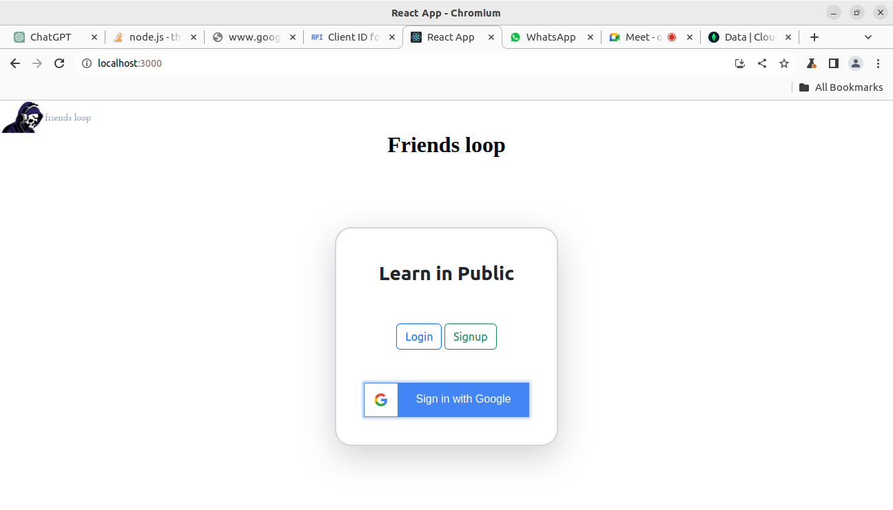
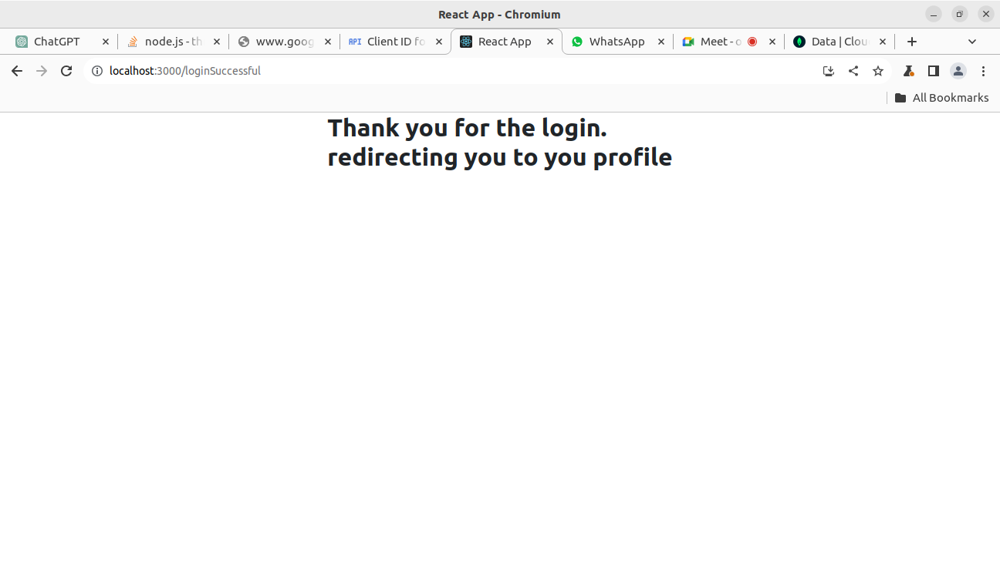
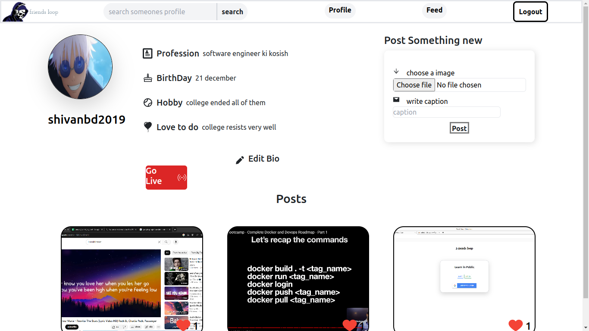
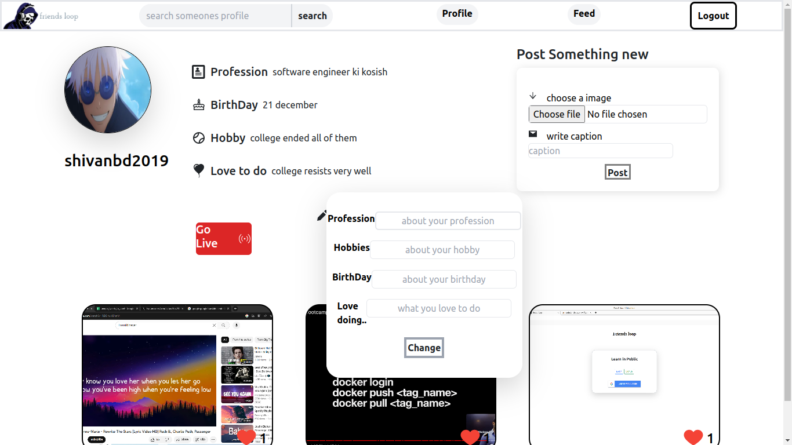
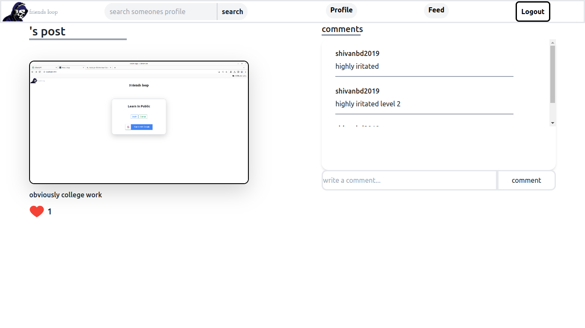
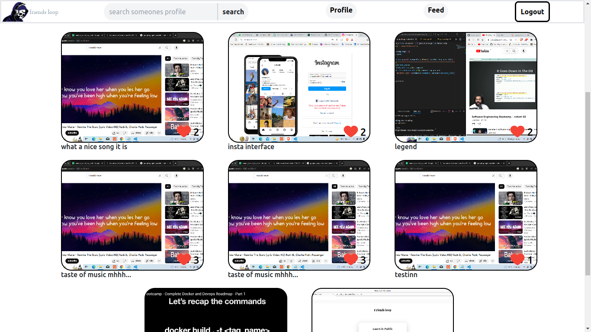
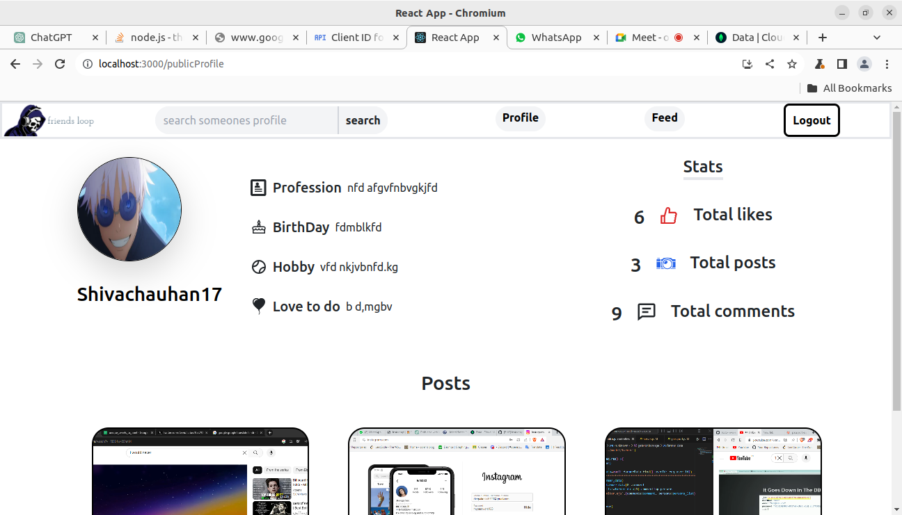
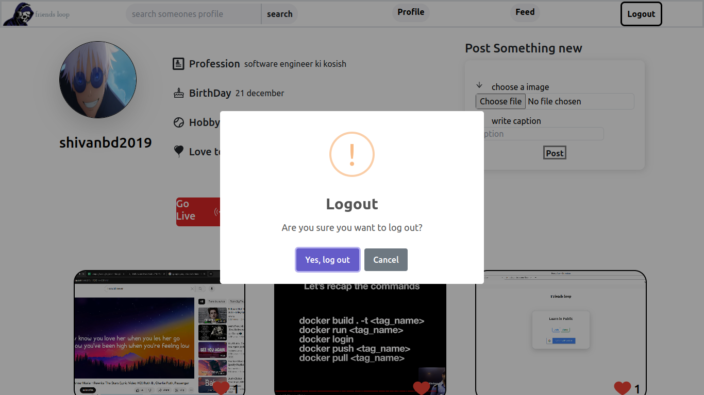

# **Introduction**
**Friends Loop** is a full stack web app which is a typical social media app with main working features. 


1.Friends Loop provide industry standard authentication with **OAuth2.0**.<br>
2.No information which concerns user personal info is being stored at frontend.
3.It provides features such as **making media post, commenting other's post, liking others post, Public feed, profile bio, searching for accounts and their stats**


## **Let's see demo imgaes**<br>
### 1.home or login signup page:<br>



### 2.Successful login:<br>



### 3.main Profile Page:<br>


### 4.To change bio:<br>


### 5.Opening a post:<br>
If the post belongs to the user who has logged in. he will be able to delete that post.



### 6.Public feed:<br>


### 7.Public profile:<br>


### 7.Lognout:<br>
On logout backend session will be deleted



<br>
<br>
<br>

## **Optimizations**:<br>
**Some possiblie features/optimizations include:**

1.Ability to edit post.<br>

<br>
<br>
<br>


## How to setup on your local system:<br>

1.Clone the project:
``` 
git clone https://github.com/Shivachauhan17/social-network-webaap.git
```
<br>
2.To run backend server first open the repo then run:<br>

```
npm i 
npm run dev
```

<br>
3. To run frontend development server go into frontend folder then run:

```
npm i
npm start
```
<br>

**note: do not forgot to put the .env on its right place**
 

